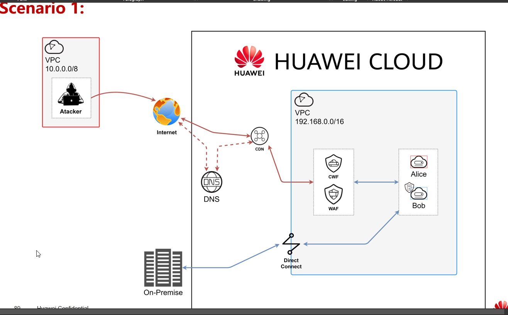

# Sec-deploy
------------
this is a simple security deploy on huawei cloud using terraform.

The deploy is going to use the following resources:

* VPC's
* Subnets
* Security groups
* Entreprise router
* Elastic cloud server
* Elastic IP's
* Cloud friewalls
  
The solution should follow the following diagram

## Steps
------------
1. Install Terraform
2. Add the oficial provider
3. Obtain Active and Secret Key (AK/SK)
4. Resoources are deploy to the cloud

## Requirements
------------
* Terraform: https://www.terraform.io
* Huawei provider: https://github.com/huaweicloud/terraform-provider-huaweicloud

## Instructions
------------
* Obtain a AK/SK from the Huawei Cloud console in [MyCredentials](https://console-intl.huaweicloud.com/iam/#/mine/apiCredential) page 
* Add your AK/SK data and region to the **terraform.tfvars** terraform file
* Don't forget initialize your environment with: `terraform init`
* Apply the script into the cloud using: `terraform apply`
  
## Other usefull commands
------------
* I have notes in spanish of a quicklist of the commands I found useful using Terraform: [terraform-commands](terraform-commands.md "comandos utiles")

## subprograms
------------
* there is two folders in this proyect:
  1.  *WAF+DNS:* is for the WAF+DNS deploy that currently is not working 
  2.  *Ansible:* is for the setting of HSS in the bob ECS using Ansible
